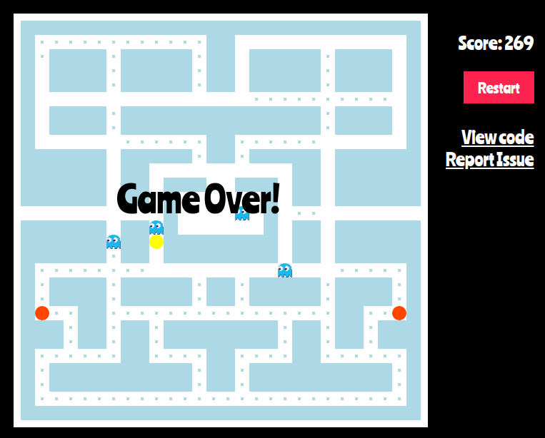

<!-- PROJECT LOGO -->
<p align="center">
  <h3 align="center">Pacman</h3>
  <p align="center">
    A maze arcade game developed and released by <a href="https://en.wikipedia.org/wiki/Namco">Namco</a>.
    <br />
    <br />
    <a href="https://minhajul-karim.github.io/pacman/">View Demo</a>
    ·
    <a href="https://github.com/minhajul-karim/pacman/issues">Report Bug</a>
    ·
    <a href="https://github.com/minhajul-karim/pacman/issues">Request Feature</a>
  </p>
</p>

<!-- ABOUT THE PROJECT -->

## About The Project

<p align="center">
  <a href="https://minhajul-karim.github.io/pacman/">
    
  </a>
</p>

### Built With

- Javascript
- HTML
- CSS

<!-- GETTING STARTED -->

## Getting Started

To get a local copy up and running, follow these simple steps.

### Installation

1. Clone the repo
   ```sh
   git clone https://github.com/minhajul-karim/pacman.git
   ```
2. Install packages
   ```sh
   yarn install
   ```
3. Open the folder and run the `index.html` file in your browser.

<!-- USAGE EXAMPLES -->

## Usage

The game will start right after the page finishes loading. The yellow dot is the Pacman, the blue creatures are ghosts, the red dots are score boosters, and the blue dots are pacdots. Use `Right Arrow` `Up Arrow` and `Down Arrow` keys to move Mr. Pacman. If a ghost hits you, you are dead! Eating a pacdot will increment your score by 1. Score boosters, as the name suggests, boost you by adding 100 to your score. After eating a score booster, the ghosts become scared. If you collide with a scared ghost, you will get 200 bonus points! Click the `Restart` button to restart the game.

<!-- CONTACT -->

## Contact

Minhajul Karim - [@minhajul93](https://twitter.com/minhajul93) - minhajul.kaarim@gmail.com

Project Link: [https://github.com/minhajul-karim/pacman/](https://github.com/minhajul-karim/pacman/)

<!-- ACKNOWLEDGEMENTS -->

## Acknowledgements

- [The Frontend Developer Career Path - Scrimba](https://scrimba.com/learn/frontend)
- [Ania Kubów](https://twitter.com/ania_kubow)
- [Best-README-Template
  ](https://github.com/othneildrew/Best-README-Template)
